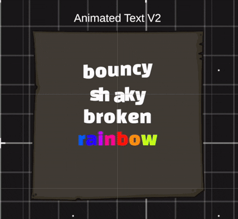
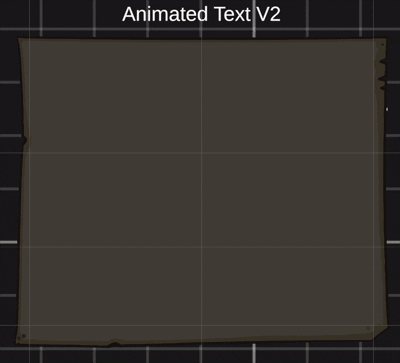
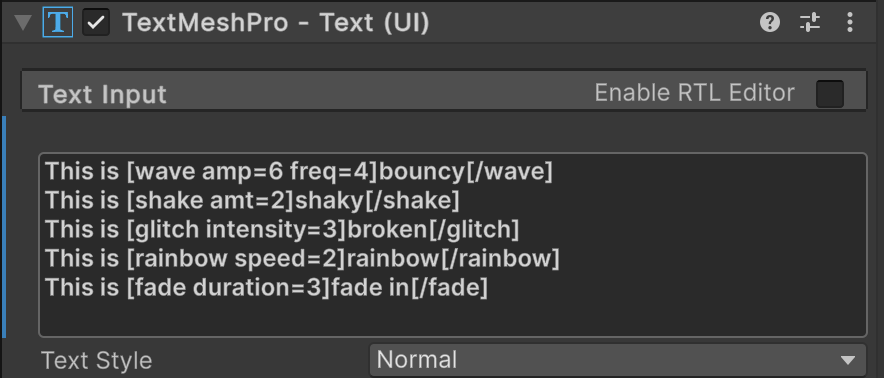

# TMPAnimatedText

This Unity package provides animated text effects for TextMesh Pro.





To animate text, simply wrap it with the corresponding `[anim]` tag. This syntax is similar to Godot's **RichTextLabel** functionality, where you can easily apply text formatting and animations directly within the text string.


Here’s the basic syntax:


## Installation

You can add this package to your Unity project using Unity's Package Manager with the following Git URL.

### Using the Unity Package Manager

1. Open your Unity project.
2. Navigate to **Window** > **Package Manager**.
3. Click the "+" button in the top-left corner of the Package Manager window.
4. Select **Add package from Git URL...**.
5. Paste the following URL into the input field:

   https://github.com/lisachidem/TMPAnimatedText.git?path=TMPAnimatedEffects
   
7. Click **Add**.

This will automatically download and install the `TMPAnimatedText` package into your Unity project.

### Alternatively, Add via `manifest.json`

If you'd prefer to manually add the package to your `manifest.json`, follow these steps:

1. Open the `manifest.json` file located in the `Packages` folder of your Unity project.
2. Add the following entry to the `"dependencies"` section:
```json
"com.lisachidem.tmpanimated": "https://github.com/lisachidem/TMPAnimatedText.git?path=TMPAnimatedEffects"
